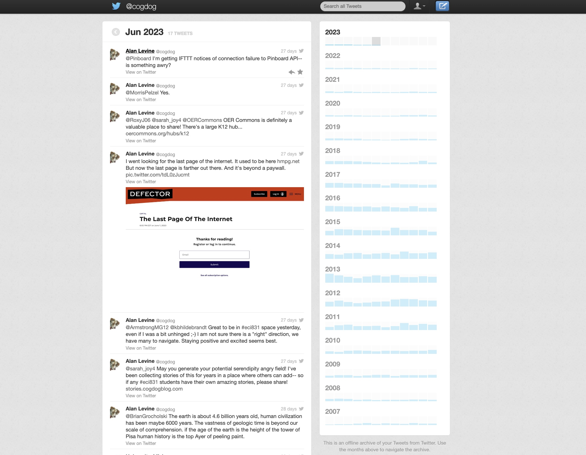

# @cogdog Twitter Archive
From January 2007 to May 2023 a one time dynamic archive of my twitter activity with assist by the genius @mhawksey available as a no longer updating archive at [https://cogdog.github.io/tweets/](https://cogdog.github.io/tweets/)

For the full details, see [That Twitter Archive? Thanks to Martin Hawksey (Genius) ITS ALIVE](https://cogdogblog.com/2013/01/martin-hawksey-genius/).

This, like most good things in twitter, was killed brutLLY in 2023 with the sword falling of it's own API.

Thanks for nothing to the jerks who run twitter now. This is the purpose of archving, because my tweet history is saved in a place I control, even if you now have to login and risk running out your daily allowable views to even see tweets.

Yup. The bird is dead to me.

